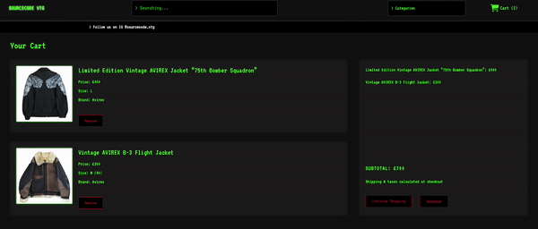

SOURCECODE_VTG – Vintage Streetwear Store

An e-commerce web application for vintage streetwear with a Matrix CRT aesthetic, built with Ruby on Rails. Users can browse garments, add them to a cart, and securely checkout using Stripe Embedded Payments.

Users can:
- Browse curated garments
- Add items to a shopping cart
- Checkout securely using **Stripe Embedded Payments**

---

## Demo Walkthrough

### Home / Index Page
Browse the latest vintage drops.


---

### Garment Show + Cart
View garment details and add them to the cart.


---

### Checkout
Seamless and secure checkout powered by Stripe Embedded Payments.



---

### Mobile Optimized
Fully responsive CRT-inspired design on mobile.


---

## Features
- CRT-inspired **Matrix design**
- Mobile-responsive UI
- Garment carousel with multiple photos
- Secure payments with **Stripe**
- User-friendly shopping flow

---

##  Built With
- [Ruby on Rails](https://rubyonrails.org/) – backend framework
- [PostgreSQL](https://www.postgresql.org/) – database
- [Bootstrap](https://getbootstrap.com/) – responsive styling
- [Turbo](https://turbo.hotwired.dev/) – fast page navigation
- [Stripe](https://stripe.com/) – embedded checkout

---

## Getting Started

### Prerequisites
- Ruby `3.x`
- Rails `7.x`
- PostgreSQL

### Setup
```bash
# Clone the repo
git clone https://github.com/Aharown/sourcecode_vtg.git
cd sourcecode_vtg

# Install dependencies
bundle install

# Setup database
rails db:create db:migrate db:seed

# Start the server
bin/dev
